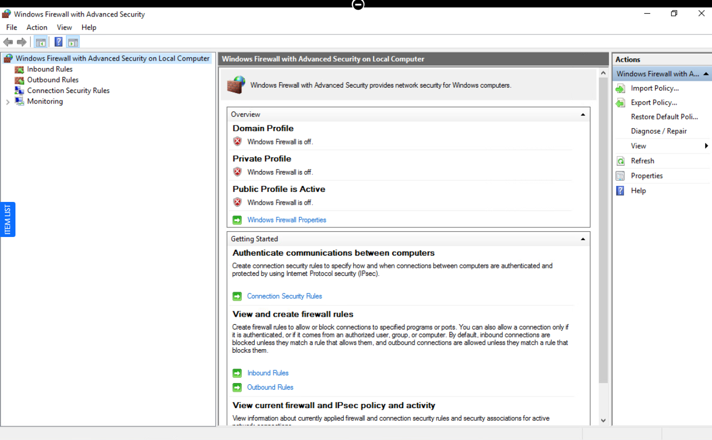
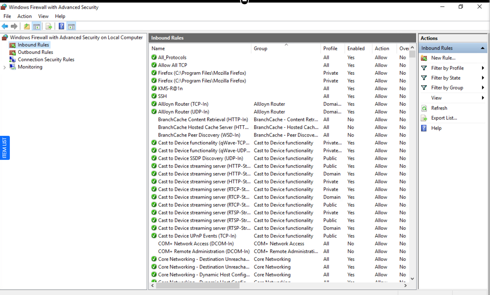
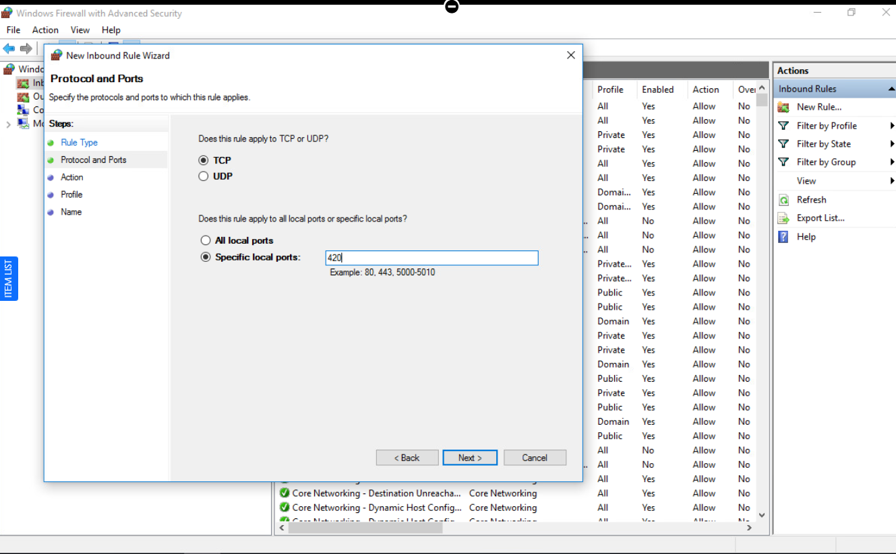
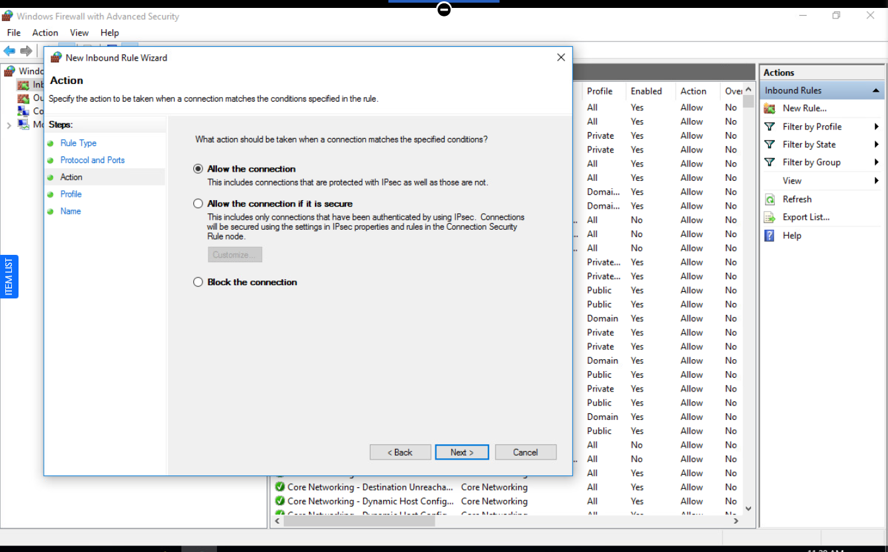
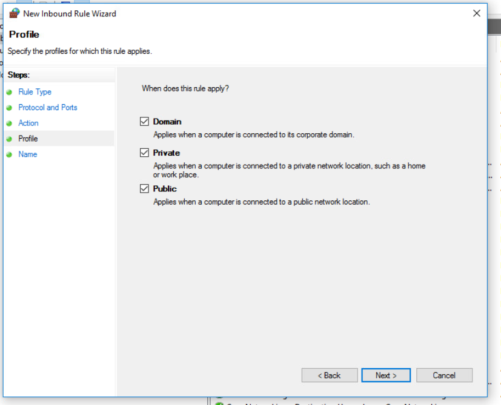
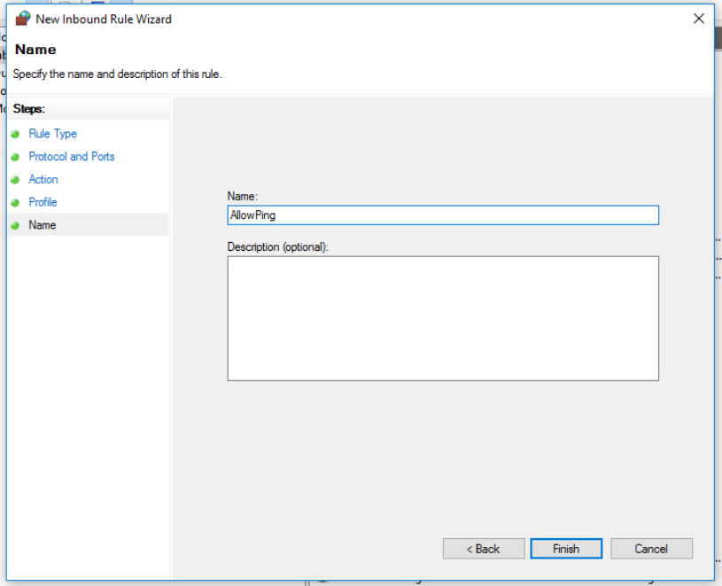
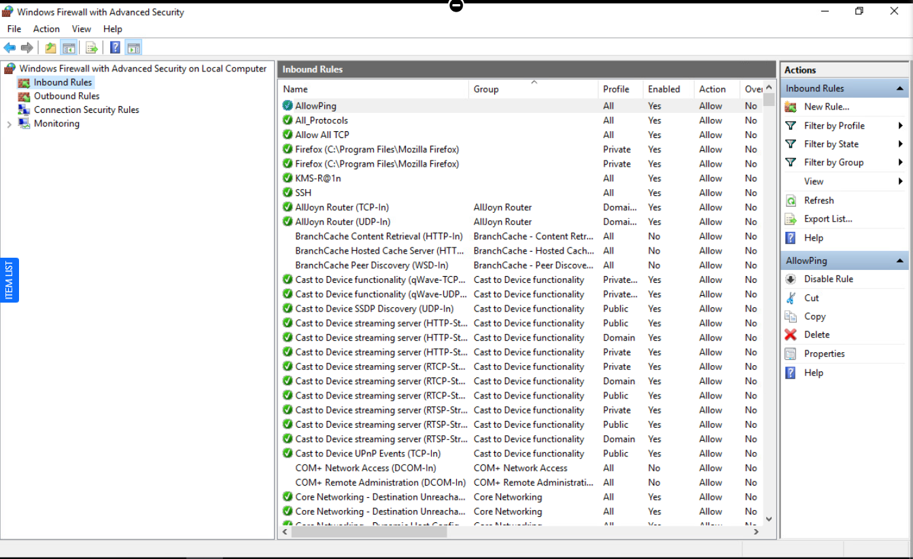

# 🔥 Windows Firewall Rule Lab – Port 420

> CySA+ Project: This lab showcases defensive skills for host-based firewalls and maps directly to CompTIA Security+ and CySA+ network security objectives.


## 📌 Overview

This lab demonstrates how to create an inbound firewall rule using **Windows Defender Firewall with Advanced Security**.

The objective is to allow inbound traffic on TCP port 420 by creating and validating a firewall rule named `AllowPing`.

---

## 🎯 Objectives

- Create an inbound firewall rule.
- Configure protocol and port settings.
- Allow network traffic through a specific port.
- Understand Windows firewall rule behavior and verification.

---

## 🛠️ Tools Used

- Windows 10/11 virtual machine.
- Windows Defender Firewall with Advanced Security.
- PowerShell for verification.

---

## 📊 Lab Steps & Evidence

### 1. Open Firewall Console

Opened Windows Defender Firewall with Advanced Security to manage inbound rules.



---

### 2. Navigate to Inbound Rules

Reviewed existing inbound rules and their actions (Allow/Deny).



---

### 3. Create New Rule (Port 420)

Configured a new inbound TCP rule for specific local port **420**.



---

### 4. Allow Connection

Selected **Allow the connection** and applied it to all profiles (Domain, Private, Public) for the rule.

  


---

### 5. Final Rule Created

Verified the rule `AllowPing` was successfully created and is enabled.

  


---

## 🧠 Key Concepts

- **Firewall Rule**: Controls network traffic based on defined criteria.  
- **Inbound Traffic**: Incoming connections to a system from external hosts.  
- **Port Filtering**: Allowing or blocking traffic by port number.  
- **Security Profiles**: Windows firewall contexts (Domain, Private, Public) that control which rules apply on each network type.

For deeper conceptual notes, see `Notes/firewall-concepts.md`.

---

## 🔐 Security Insight

Opening a port allows external systems to initiate connections to your machine, which can increase your attack surface if the exposed service is not secured.

From a defensive standpoint, firewall rules should follow the principle of **least privilege**—only allowing necessary traffic while blocking all other unnecessary access.

---

## 🧠 SOC Analyst Perspective

Attackers:

- Use tools like Nmap to scan for open ports.
- Identify exposed services for exploitation.
- Target misconfigured firewall rules.

Defenders:

- Restrict unnecessary open ports.
- Monitor inbound firewall and network logs.
- Regularly review and harden firewall configurations.

---

## 🚀 Outcome

Successfully created and validated an inbound firewall rule allowing TCP traffic on port 420, demonstrating practical understanding of network access control and host-based firewall configuration.

---

## 📚 Certification Mapping

This lab reinforces objectives from:

- **CompTIA Security+ (SY0‑701)**
  - Threats, vulnerabilities, and mitigations.
  - Security architecture and network design.
  - Securing endpoints and host-based controls.

- **CompTIA CySA+ (CS0‑003)**
  - Security operations and monitoring.
  - Vulnerability management and remediation.
  - Incident response and reporting (using firewall evidence).

---

## 🧪 Verification

```powershell
Get-NetFirewallRule -DisplayName "AllowPing" |
    Select-Object DisplayName, Enabled, Action
```

### Expected Result

- `DisplayName` = `AllowPing`  
- `Enabled` = `True`  
- `Action` = `Allow`  

You can also verify connectivity by:

- Pinging the host (if ICMP is allowed).
- Testing TCP port 420 from another system on the same network.

---

## ✍️ Author

**Author:** Mozella L. McCoy-Flowers (`BecomingCyber`)  
**Role:** Cybersecurity & Digital Forensics Student – Virginia State University  
**Focus:** Blue-team homelabs, host-based security, and incident response